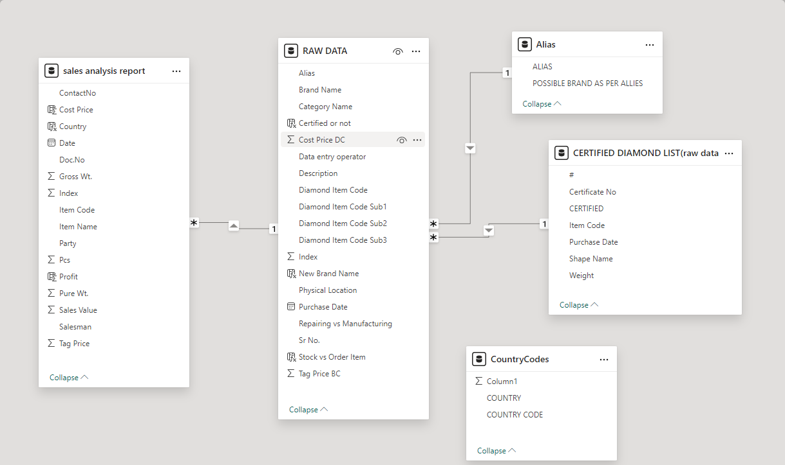
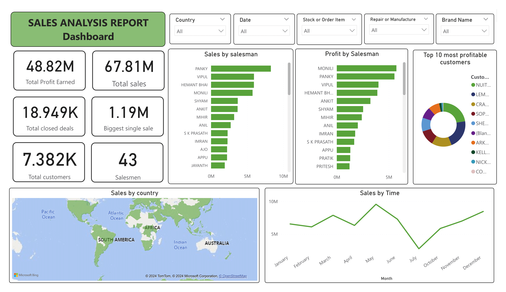
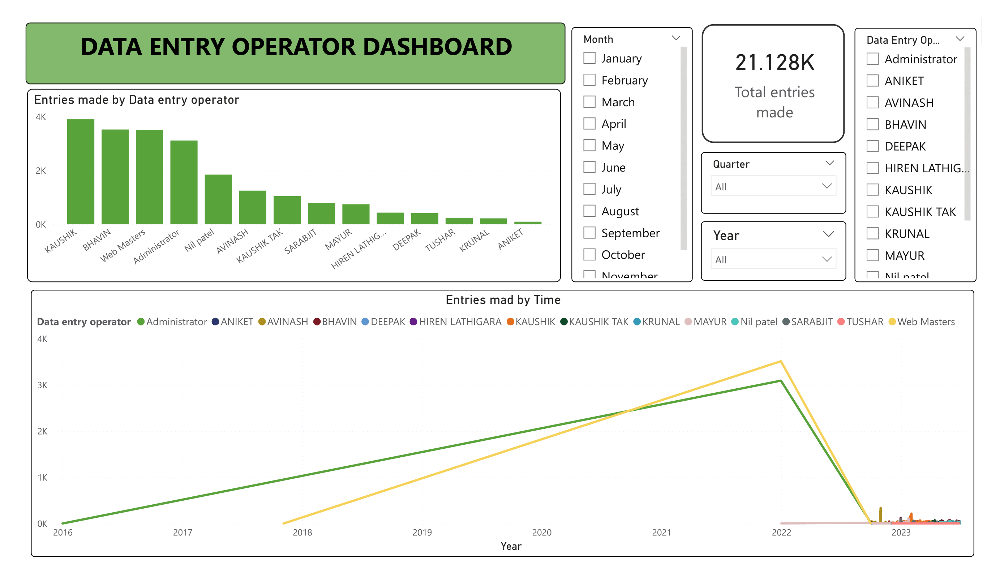
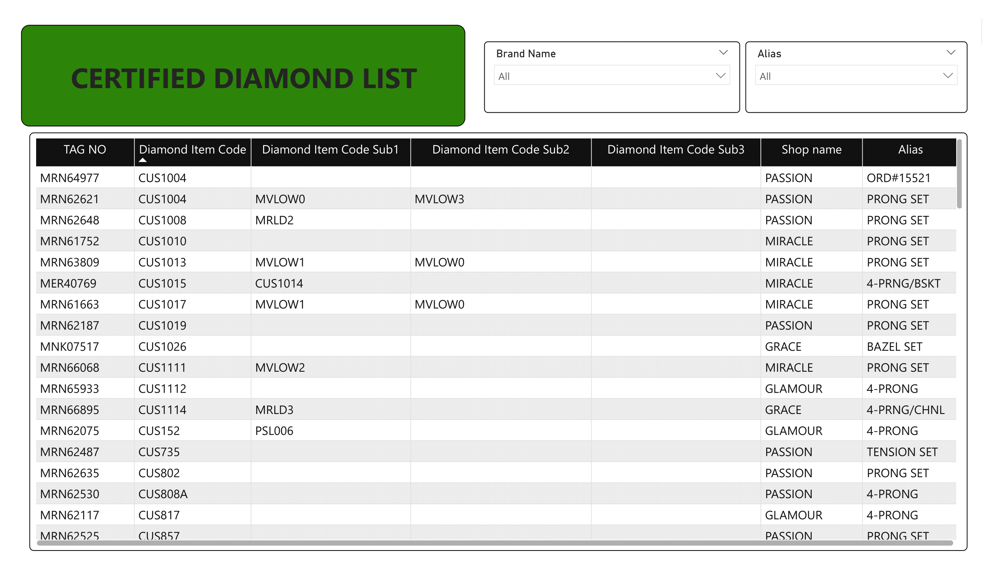

# Sales-Analysis-Dashboard
## Introduction

This Power BI dashboard serves as a comprehensive analytical tool designed to provide deep insights into the sales and operational performance of a diamond shop. Leveraging data from a single Excel file with multiple tabs, the dashboard effectively consolidates information related to sales analysis, certified diamonds, and data entry operations.

With dynamic slicers and interactive visuals, users can effortlessly explore various aspects of the business, including sales performance by country, profitability by customer, and operational efficiency of data entry operators. This report aims to highlight key metrics such as total profit, sales figures, customer statistics, and the performance of salesmen, all of which are essential for informed decision-making.

The dashboard not only facilitates data exploration but also empowers stakeholders to identify trends and uncover opportunities for growth, ensuring that strategic initiatives are backed by actionable insights.

## Objectives

The primary objectives of this Power BI dashboard are:

1. To analyze sales performance metrics, including total profit, sales volume, and customer engagement.
2. To monitor data entry activities, enabling assessment of operational efficiency by data entry operators.
3. To evaluate the certified diamond inventory, assisting in product management and marketing strategies.
4. To facilitate decision-making processes through visual analytics, aiding in strategic planning and operational adjustments.

## Data Source

The data utilized for this dashboard is sourced from a single Excel file containing multiple tabs, each representing different tables relevant to sales analysis, raw data, country codes, and certified diamonds. 

These tables are:

1. **Raw Data**: Contains comprehensive details about diamond jewelry, including pricing, descriptions, and certification status.
2. **Sales Analysis Report**: Provides insights into sales transactions, including profit, cost price, and customer information.
3. **Certified Diamond List**: Details certified diamonds, including their specifications and certification details.
4. **Alias**: This table maps brand aliases to their official names, ensuring that product identification remains consistent across sales records and enabling accurate reporting.
5. **Country Codes**: Maps country names to their respective codes, aiding in regional analysis.

## Visualizations

### Sales Analysis Report Page

The Sales Analysis Report page is designed to provide a holistic view of sales performance. It features interactive slicers for filtering data by country, date, stock or order item status, repair or manufacture status, and brand name. Card visuals prominently display key performance indicators such as total profit earned, total sales, total closed deals, the biggest single sale, total customers, and a count of salesmen, offering a quick glance at critical metrics.

The visualizations on this page include horizontal bar charts illustrating sales and profit by salesman, which allow for easy comparison of performance among sales representatives. Additionally, doughnut charts provide insights into the top 10 most profitable customers. A map visual provides insights into sales by country, and a line chart for sales performance over time. These visuals collectively empower users to identify trends, assess performance, and recognize opportunities for improvement.

### Data Entry Operator Dashboard Page

The Data Entry Operator Dashboard page focuses on the activities of data entry operators. It includes slicers for filtering data by month, quarter, year, and specific data entry operators, facilitating detailed analysis of performance over different periods. A card visual highlights the total entries made, providing a snapshot of overall productivity.

The bar chart displays the number of entries made by each data entry operator, allowing for a comparative assessment of individual performance. Furthermore, a line chart illustrates the entries made over time, with the data entry operator serving as the legend. This combination of visuals helps identify trends in data entry activity and pinpoint areas for operational improvement.

### Certified Diamonds Page

The Certified Diamonds page is dedicated to the management and analysis of certified diamonds. Slicers for brand name and alias enable users to filter the inventory based on specific criteria. The primary visual is a matrix that displays key attributes such as tag number, diamond item code, and various sub-codes, alongside shop name and alias.

This structured visual representation aids in comprehensive product management, allowing users to quickly assess inventory status, track diamond certifications, and facilitate strategic marketing efforts.

## Findings

The dashboard reveals several significant findings:

1. Sales performance is highly variable across different salesmen, with some achieving significantly higher profits than others. This indicates potential for targeted training or support for lower-performing sales personnel.
2. The analysis of data entry activities highlights discrepancies in workload distribution among data entry operators, suggesting a need for reassessment of task assignments to enhance efficiency.
3. The certified diamonds inventory shows a well-defined tracking system, but opportunities exist to improve visibility of product specifications and certification status to enhance customer engagement.

## Recommendations

Based on the findings, several recommendations are proposed:

1. Implement targeted training programs for sales staff, focusing on best practices and strategies employed by top performers to elevate overall sales effectiveness.
2. Reevaluate the distribution of data entry tasks among operators to optimize workload balance and increase productivity.
3. Enhance the visibility of certified diamond attributes in marketing materials, ensuring that customers have access to clear and detailed information to facilitate informed purchasing decisions.

## Conclusion

The Power BI dashboard serves as a valuable tool for analyzing sales performance, monitoring data entry operations, and managing certified diamonds. By leveraging interactive visualizations and comprehensive data, the dashboard enables stakeholders to make informed decisions and identify areas for strategic improvement. As the organization continues to grow, ongoing enhancements to the dashboard will be essential in maintaining its relevance and effectiveness in driving performance and operational efficiency.
